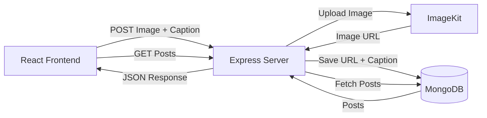
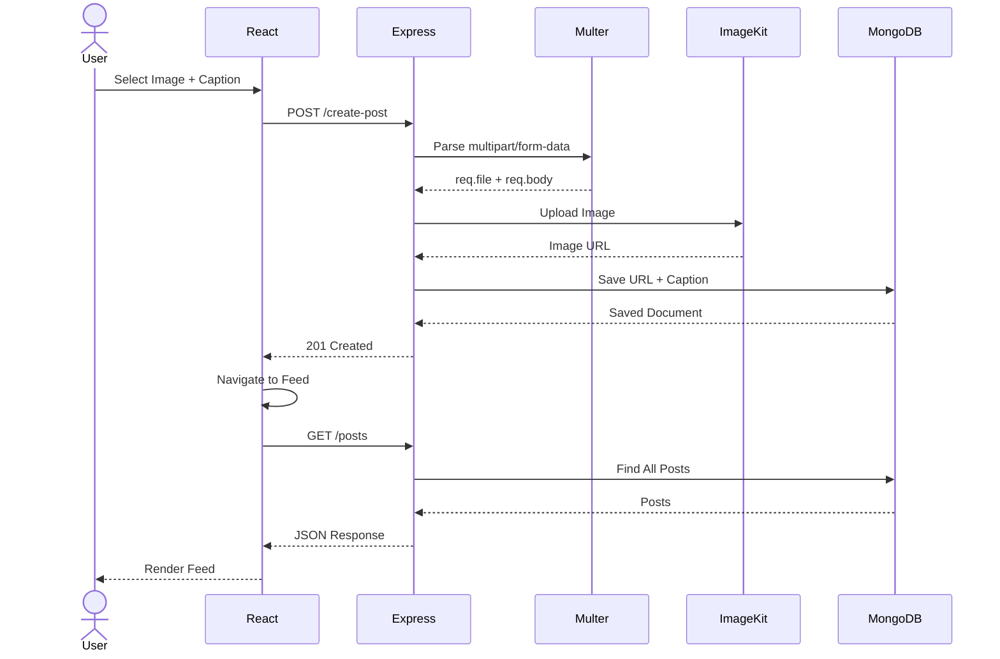

# 📸 Mini MERN Image Feed

<p align="center">
  
  
  
  
  
</p>

A beginner-friendly **MERN Stack** project that allows users to upload images with captions, store them in the cloud using **ImageKit**, save metadata in **MongoDB**, and display all uploaded posts in a beautiful feed.

---

# ✨ Features

- 📤 Upload images with captions
- ☁️ Store images securely in ImageKit
- 🗄️ Save image URL & caption in MongoDB
- 📰 View uploaded posts in a feed
- ⚡ REST API using Express
- 📁 Multer-based file upload handling
- 🔄 React Router navigation
- 🌐 Axios-based frontend/backend communication

---

# 🛠 Tech Stack

| Frontend | Backend | Database | Cloud |
|----------|----------|----------|-------|
| React | Node.js | MongoDB | ImageKit |
| React Router | Express | Mongoose | Image Hosting |
| Axios | Multer | | |

---

# 📂 Project Structure

```text
project-root/
│
├── backend/
│   ├── server.js
│   └── src/
│       ├── app.js
│       ├── db/
│       │   └── db.js
│       ├── models/
│       │   └── post.model.js
│       └── services/
│           └── storage.services.js
│
└── frontend/
    └── src/
        ├── App.jsx
        └── pages/
            ├── CreatePost.jsx
            └── Feed.jsx
```

---

# ⚙️ Environment Variables

Create a `.env` file inside the backend folder.

```env
MONGO_DB_URI=your_mongodb_connection_string

IMAGE_KIT_PRIVATE_KEY=your_imagekit_private_key
```

These variables are loaded using **dotenv**.

---

# 🚀 API Endpoints

## Create Post

```http
POST /create-post
```

Uploads one image and one caption.

### Request

- Content-Type: `multipart/form-data`

| Field | Type |
|--------|------|
| image | File |
| caption | Text |

### Response

```json
{
  "_id": "...",
  "image": "https://...",
  "caption": "Hello World"
}
```

---

## Get Posts

```http
GET /posts
```

Returns all uploaded posts.

---

# 🏗 System Architecture



---

# 🔄 Upload Workflow



---

# 📖 Complete Data Flow

## 1️⃣ User uploads a post

Inside **CreatePost.jsx**, the user selects:

- Image
- Caption

```jsx
const formData = new FormData(e.target);
```

This automatically collects every form field.

---

## 2️⃣ Frontend sends the request

```js
axios.post(
    "http://localhost:3000/create-post",
    formData
)
```

The request uses **multipart/form-data**, allowing both text and binary files to be sent together.

---

## 3️⃣ Express receives the request

```js
app.post(
    "/create-post",
    upload.single("image"),
    async(req,res)=>{}
)
```

Multer extracts:

```text
req.file
req.body.caption
```

The uploaded image is stored temporarily in memory.

---

## 4️⃣ Upload to ImageKit

The image buffer is sent to ImageKit.

```text
Buffer
    ↓
Base64
    ↓
ImageKit Upload API
    ↓
Hosted Image URL
```

Example URL:

```
https://ik.imagekit.io/...
```

---

## 5️⃣ Save metadata

Only the URL and caption are stored.

```js
postModel.create({
    image: imageURL,
    caption: req.body.caption
})
```

Database document:

```json
{
    "image":"https://...",
    "caption":"Beautiful Sunset"
}
```

---

## 6️⃣ Backend responds

```http
201 Created
```

The frontend redirects the user.

```js
navigate("/feed")
```

---

## 7️⃣ Feed fetches posts

```js
axios.get(
    "http://localhost:3000/posts"
)
```

Backend executes:

```js
postModel.find()
```

---

## 8️⃣ React renders the feed

```jsx
posts.map(post=>(
    
))
```

Each post displays:

- Image
- Caption

🎉 Upload complete!

---

# 📦 How to Run

## Backend

```bash
cd backend

npm install

npm run dev
```

or

```bash
node server.js
```

---

## Frontend

```bash
cd frontend

npm install

npm run dev
```

Open the Vite URL shown in the terminal.

---

# 📚 Concepts Covered

This project demonstrates:

- React Components
- React Router
- Axios Requests
- Express APIs
- Multer File Uploads
- MongoDB CRUD
- Mongoose Models
- ImageKit Integration
- Environment Variables
- CORS Configuration
- FormData
- REST Architecture

---

# 🎯 What Happens Internally?

```text
User
 │
 ▼
Select Image
 │
 ▼
FormData
 │
 ▼
Axios
 │
 ▼
Express
 │
 ▼
Multer
 │
 ▼
Buffer
 │
 ▼
ImageKit
 │
 ▼
Image URL
 │
 ▼
MongoDB
 │
 ▼
Saved Post
 │
 ▼
React Feed
```

---

# 🔒 Current Limitations

- No authentication
- No image validation
- No loading state
- No error middleware
- No edit/delete
- No pagination

---

# 🚀 Future Improvements

- ✅ JWT Authentication
- ✅ Backend Validation
- ✅ File Size Limits
- ✅ Image Type Validation
- ✅ Delete Posts
- ✅ Edit Posts
- ✅ Likes & Comments
- ✅ Infinite Scrolling
- ✅ Deployment (Vercel + Render)
- ✅ Docker Support

---

# 🎓 Learning Outcomes

By building this project, you'll understand:

- How browsers upload files
- How Multer processes multipart/form-data
- How cloud storage services work
- Why only metadata is stored in databases
- React ↔ Express communication
- Complete MERN request lifecycle

---

# 🧠 Remember This Flow

```text
FormData
      ↓
Axios
      ↓
Express
      ↓
Multer
      ↓
Image Buffer
      ↓
ImageKit
      ↓
Image URL
      ↓
MongoDB
      ↓
GET /posts
      ↓
React Feed
```

---

# ⭐ Key Takeaway

> **FormData → Multer → ImageKit → MongoDB → Express API → React Feed**

This project is a compact but complete demonstration of the entire image upload lifecycle in a MERN application, making it an excellent beginner project for understanding full-stack development.
